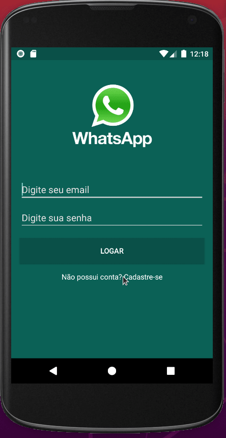
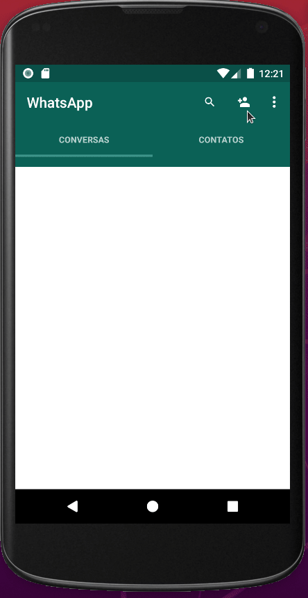
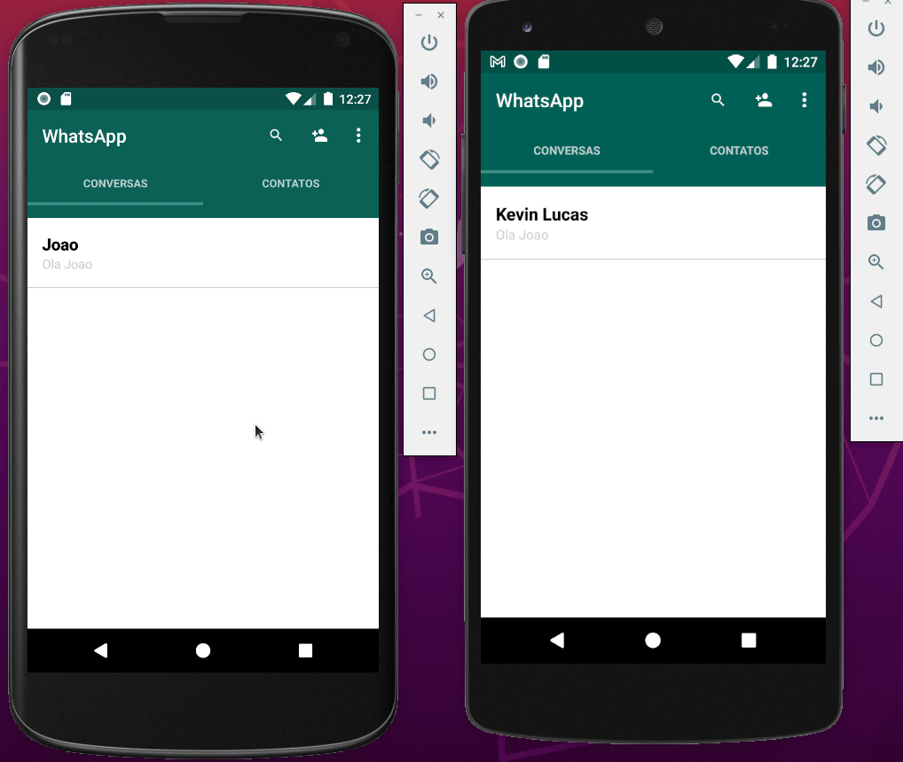

# Whatsapp Clone MVVM

Aplicativo clone do Whatsapp, desenvolvido com Kotlin, Firebase e MVVM.

# Features
- [x] Usuário realizar um novo cadastro utilizando e-mail e senha.
- [x] Usuário pode adicionar um contato a sua lista de contatos.
- [x] Usuários podem trocar mensagens em tempo real.
- [x] Usuário pode fazer o login e o logout da conta.

# Tecnologias
As seguintes tecnologias foram utilizadas no projeto:

- [Android](https://developer.android.com/)
- [Kotlin](https://kotlinlang.org/)
- [MVVM](https://developer.android.com/jetpack/guide?hl=pt-br)
- [Firebase](https://firebase.google.com/?hl=pt)

# Screencast

Novo Usuário

<h1>
    
</h1>

Novo Contato

<h1>
    
</h1>

Chat

<h1>
    
</h1>

# Desenvolvimento 
* Java: 1.8.0 ou superior
* Puglin Kotlin: 1.5.10 ou superior 
* Android Studio: 4.2.1 ou superior
* Android SDK: Versão API 30 (Android 11.0) ou superior 

# Considerações
Aplicativo desenvolvido com objetivos de divulgar e compatilhar meus conhecimentos sobre Dev Android. 

Feito por Kevin Lucas, me siga [Linkedin](https://www.linkedin.com/in/kevinlucasdev/). Obrigado!